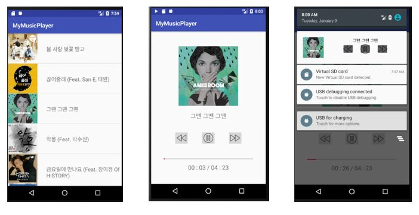

# MusicPlayer

- A music player application that functions as an mp3 player.

## Functions
1. Play
2. Pause
3. Previous , next song play
4. App notification

##  Requirement
- Android 6.0 (Marshmallow)
